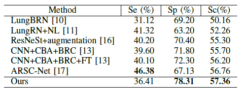

# Classifying Respiratory Diseases with Deep Learning
Classifying Respiratory diseases with Pre trained Neuro Network using Attention and Vision Transformer on respiratory sound data.

## Objective

Respiratory sounds are important indicators of respiratory health and respiratory disorders. The sound emitted when a person breathes is directly related to air movement, changes within lung tissue and the position of secretions within the lung. A wheezing sound, for example, is a common sign that a patient has an obstructive airway disease like asthma or chronic obstructive pulmonary disease (COPD).
These sounds can be recorded using digital stethoscopes and other recording techniques. This digital data opens up the possibility of using machine learning to automatically diagnose respiratory disorders like asthma, pneumonia and bronchiolitis, to name a few.

## Dataset 

Link to oficial repository: https://bhichallenge.med.auth.gr/ICBHI_2017_Challenge
Link to dataset from Kaggle: https://www.kaggle.com/vbookshelf/respiratory-sound-database

The Respiratory Sound Database was created by two research teams in Portugal and Greece. 

It includes 920 annotated recordings of varying length - 10s to 90s. 

These recordings were taken from 126 patients. 

There are a total of 5.5 hours of recordings containing 6898 respiratory cycles - 1864 contain crackles, 886 contain wheezes and 506 contain both crackles and wheezes. 

The data includes both clean respiratory sounds as well as noisy recordings that simulate real life conditions. The patients span all age groups - children, adults and the elderly.

## Results  
  
### Ablation Studies
  
### Best Model 
The pre trained model you can download from <here>(https://drive.google.com/file/d/1PDR9WpBqZivaL0h2YIhNljP2WXoYGz7U/view?usp=sharing)

